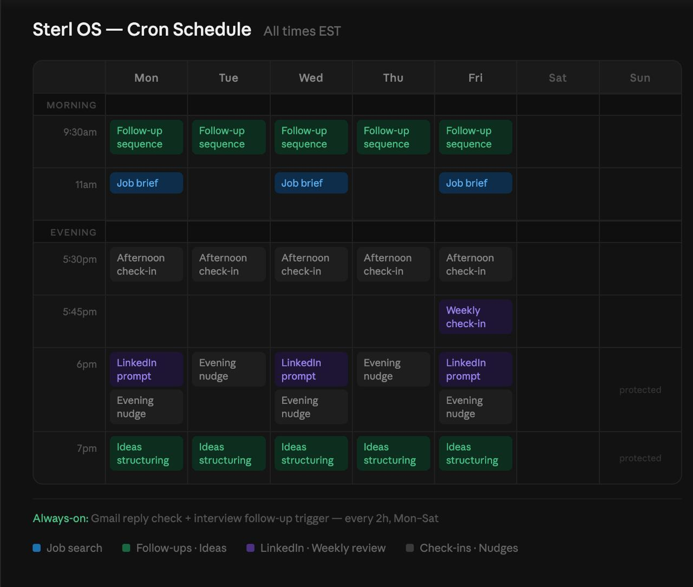
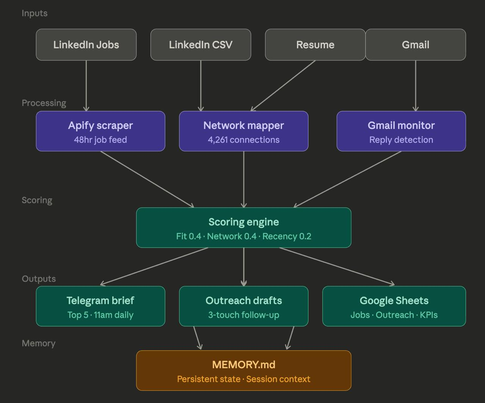

# Sterl — Network-First Job Search Agent

An autonomous job search agent that runs on a VPS, scrapes LinkedIn via Apify, scores jobs against your network, and delivers a daily brief via Telegram.

Built on [OpenClaw](https://openclaw.ai) + Claude Sonnet.

---

## What It Does

- **Mon/Wed/Fri 11am** — scrapes LinkedIn for PM roles, scores by fit + network + recency, sends top 5 to Telegram
- **Daily 2pm** — reminds you to send thank-you notes after interviews, drafts them for you
- **Daily 6pm** — evening nudge if you have unactioned jobs or overdue follow-ups
- **Every 2h** — checks Gmail for replies to outreach, auto-updates Google Sheets tracker
- **Friday** — ends brief with: "Is the pipeline moving? Yes or no."

Nothing drops. If you don't action something, it carries forward automatically until you say pass, done, or park.

---

## Cron Schedule



---

## Architecture



> Note: brief fires Mon/Wed/Fri (not daily). Follow-up cadence is Day 3/5/7/14.

---

## Stack

| Component | Purpose |
|---|---|
| OpenClaw | AI agent runtime + Telegram bridge |
| Claude Sonnet | Scoring, drafting, formatting |
| Apify | LinkedIn job scraper |
| Google Sheets | Job tracker (Jobs, Interviews, Outreach, Contacts, KPIs) |
| Gmail API | Reply detection |
| Cron | Scheduling |

---

## Setup

### 1. Prerequisites

- VPS running Ubuntu (DigitalOcean $6/mo works fine)
- [OpenClaw](https://openclaw.ai) installed and connected to Telegram
- Python 3.10+

### 2. Install dependencies

```bash
pip install apify-client google-auth google-auth-httplib2 google-api-python-client
```

### 3. Configure environment

Set these as env vars or in a `.env` file (never commit them):

```bash
APIFY_API_TOKEN=your_apify_token_here
```

### 4. Google OAuth

1. Create a project in [Google Cloud Console](https://console.cloud.google.com)
2. Enable Sheets API + Gmail API
3. Create OAuth 2.0 credentials → download as `google_client_secret.json`
4. Run the auth flow once to generate a token (save to `config/gog-token.json`)

### 5. Telegram bot

Create a bot via [@BotFather](https://t.me/botfather) and get your:
- Bot token
- Chat ID

Update `TELEGRAM_TOKEN` and `TELEGRAM_CHAT_ID` in the scripts.

### 6. Google Sheets tracker

Create a new Google Sheet with 5 tabs: `Jobs`, `Interviews`, `Outreach`, `Contacts`, `KPIs`

Update `SHEET_ID` in the scripts with your sheet ID.

### 7. Customize job search

In `scripts/job-discovery-apify.py`, update:
- `TITLES` — job titles to search
- `TARGET_LOCATIONS` — cities/remote preference
- `TARGET_ROLES` — scoring weights for role types

### 8. Set up cron

```bash
# Job discovery brief — Mon/Wed/Fri 11am EST
0 16 * * 1,3,5 python3 /path/to/scripts/cron-job-discovery.sh

# Interview follow-up — daily 2pm EST
0 19 * * * python3 /path/to/scripts/interview-followup.py

# Evening nudge — daily 6pm EST
0 23 * * * python3 /path/to/scripts/evening-nudge.py

# Gmail reply check — every 2 hours
0 */2 * * * python3 /path/to/scripts/gmail-reply-check.py
```

---

## Scoring Logic

`priority = (0.4 × fit) + (0.4 × network) + (0.2 × recency)`

See `skills/job-scoring/SKILL.md` for full details.

---

## Network Matching

Export your LinkedIn connections as CSV (Settings → Data Privacy → Get a copy of your data → Connections).

The script fuzzy-matches job company names against your connections to surface warm paths. Threshold: 0.80.

---

## Carry-Forward Rule

Nothing is ever dropped. Unactioned jobs and overdue follow-ups appear in every brief until you explicitly say: **pass**, **done**, or **park**.
